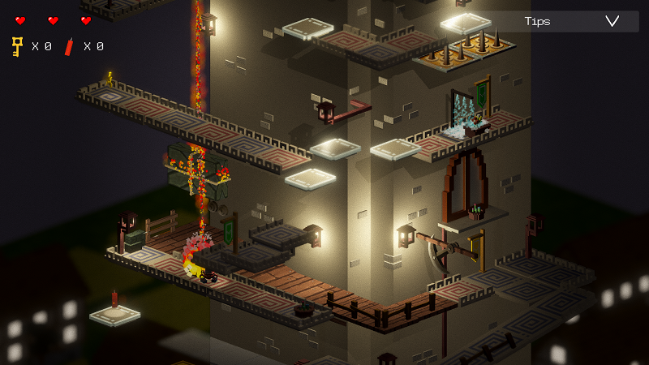

# LitFeet :video_game:
**LitFeet** is an isometric voxel-style puzzle game developed with Unity3D. 

The game is just a short demo developed as an exam project for the **"Game Programming"** course, followed during my master degree at the **"Università della Calabria"** :mortar_board:.

The hero of the game is a small candle that with its limited skills will have to descend along a tower, full of traps and dangers, to recover a magic candle.

Report with more details: [Report link](https://drive.google.com/open?id=1JQKfjl3R7vku3U1MXViANcDeGZBVj3Xu) :paperclip:

:exclamation: **NOTE**: Most of the models used were made using [Magika Voxel](https://ephtracy.github.io/) :paperclip:

### Game Images :pushpin:
Here are some game images:

### Repository Structure :construction_worker:
- The *src* folder contains the source code and all the resources used.
- The *build* folder contains a build of the game for Windows.

:exclamation: **NOTE**: tested only on Windows 10.
